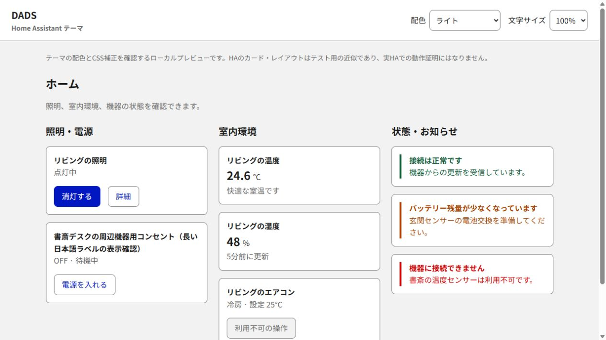
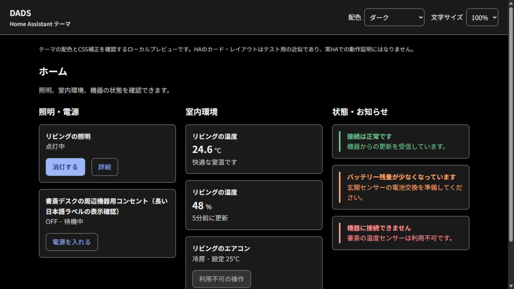

# DADS — Home Assistant テーマ

デジタル庁デザインシステムを基にした、ライト／ダーク対応のHome Assistantテーマです。BlueとGrayを中心に、読みやすい文字・控えめな角丸を使います。アイコンはHA内蔵MDI、書体は**Google FontsのNoto Sans JP**を使用します。

**基本テーマはHACSで導入・更新できます。** card-modを追加すると、カードの余白・長いラベルの折り返し・黄色と黒のフォーカス表示などのCSS補正も有効になります。

**フォントは管理画面でGoogle FontsのURLを一度追加するだけです。** 専用JS、フォントファイルのコピー、フォント用のYAML編集は不要です。[フォント設定を開く](https://my.home-assistant.io/redirect/lovelace_resources/)

[](https://my.home-assistant.io/redirect/hacs_repository/?owner=ogatomo21&repository=ha-dads&category=theme)

## HACSから導入

Home Assistant **2026.9.4以上**と[HACS](https://www.hacs.xyz/docs/use/)を使用します。npmやファイルの手動コピーは不要です。

### 1. テーマの読み込みを設定する（初回のみ）

すでにテーマを使っている場合はこの手順を省けます。初めての場合は`configuration.yaml`をバックアップし、既存の`frontend`へ次をマージして設定チェック後にHAを再起動します。

```yaml
frontend:
  themes: !include_dir_merge_named themes
```

`frontend`を二重に定義したり、既存の設定全体を置き換えたりしないでください。card-mod等の既存モジュールも残します。[設定例](examples/configuration.yaml)を参照できます。テーマの有効化は[HACSの公式手順](https://www.hacs.xyz/docs/use/repositories/type/theme/)と共通です。

### 2. HACSでダウンロード

上のボタンからHACSのリポジトリ画面を開き、表示される案内に従って追加・ダウンロードします。ボタンから開けない場合は次の方法で登録できます。

1. HACS右上の **⋮ → カスタムリポジトリ** を開きます。
2. URLに`https://github.com/ogatomo21/ha-dads`、種類に **Theme（テーマ）** を指定して追加します。
3. HACSで **DADS Theme** を開き、ダウンロードします。

HACSの標準一覧への掲載は別の申請が必要です。掲載前は上記のカスタムリポジトリ登録を利用します。[公式の登録手順](https://www.hacs.xyz/docs/faq/custom_repositories/)

### 3. Google Fontsを一度登録してDADSを選択

1. [ダッシュボードのリソース](https://my.home-assistant.io/redirect/lovelace_resources/)を開き、**リソースを追加**を押します。
2. 次のURLを貼り、種類を **Stylesheet（スタイルシート）** にして保存します。
3. ブラウザーを強制再読み込みして、一度ダッシュボードを開きます。フォント登録のためのHA再起動は不要です。

```text
https://fonts.googleapis.com/css2?family=Noto+Sans+JP:wght@100..900&display=swap
```

プロフィールのテーマを **DADS** に変更し、モードを「ライト」「ダーク」またはシステム設定への追従にします。基本の配色・書体・カード形状はこれで適用されます。

フォントは端末ごと・カードごとに登録する必要はありません。ダッシュボードで読み込んだ後は同じ画面セッションのサイドバー・設定画面・詳細ダイアログも利用できます。設定画面へ直接アクセスした場合などの制約と、以前のモジュール版からの移行は[フォント設定](docs/fonts.md)に記載しています。

HACSはダウンロード後にテーマを再読み込みします。選択肢に出ない場合は、開発者ツールのアクションで`frontend.reload_themes`を実行し、ページを再読み込みしてください。

<details>
<summary>以前の手動コピー版から移行する場合</summary>

以前の`/config/themes/dads.yaml`が残ると、HACS版と同じ`DADS`名が重複します。手動版を`/config/theme-backups/`など、`themes`の外へ退避してからHACS版を導入してください。バックアップ用のYAMLも`themes`内に置かないようにします。

HACSの保存先は通常`/config/themes/dads/dads.yaml`です。ファイルを別の場所へコピーせず、そのままHACSで管理します。

</details>

## CSS補正を有効にする（任意・推奨）

HACSで **card-mod** を導入すると、テーマに同梱したCSS補正が適用されます。標準テーマ変数だけでは届かないタイル文字の折り返し、サイドバー・ヘッダー・ダイアログ等を補正します。

設定画面にもCSS補正を適用するにはcard-modのURLを`extra_module_url`へ追加します。詳細は[card-modの設定手順](docs/card-mod.md)を参照してください。フォントのリソース登録とcard-modを併用でき、追加カスタムカードは不要です。

## プレビュー

以下は配色とCSSを確認する**ローカルHTMLプレビュー**です。実HAのスクリーンショットではなく、card-mod補正を含む近似表示です。実HAでの表示・操作は未検証です。

| ライト | ダーク |
| --- | --- |
|  |  |

## ダッシュボード例

[dashboard.yaml](examples/dashboard.yaml)を新しい空のダッシュボードの生の設定エディターへ貼り付け、次のIDを実際の機器へ置き換えます。既存ダッシュボードに追加する場合は`views`内をマージしてください。

| 例のエンティティID | 置換する機器 |
| --- | --- |
| `light.living_room` | 調光対応のリビング照明 |
| `switch.desk_power` | デスクの電源スイッチ |
| `sensor.living_room_temperature` | 室温センサー |
| `sensor.living_room_humidity` | 湿度センサー |
| `climate.living_room` | リビングの空調 |

標準Sectionsビュー・最大3列で、使用可能幅に応じて折り返します。カードは全幅・行数`auto`です。長いタイル名の折り返しにはcard-mod補正を利用してください。調光非対応の照明では`light-brightness`を削除します。履歴表示にはrecorderで対象センサーを記録している必要があります。

HACSがインストールするのはテーマ本体です。ダッシュボード例は必要な場合に追加します。テーマの適用はプロフィールで行い、例のビューには固定しません。

## 更新・復旧

- テーマの更新はHACSの更新操作で行います。ファイルの再コピーは不要です。反映されない場合はテーマを選び直し、ページを再読み込みします。
- card-modの更新時は[URLとキャッシュの確認手順](docs/card-mod.md#更新時)も実施してください。
- 元に戻すにはプロフィールで標準テーマを選択します。ビューやカードにもテーマを明示指定した場合は解除します。削除する場合は標準テーマへ戻した後、HACSからDADS Themeを削除します。
- 設定変更で起動できない場合はバックアップした`configuration.yaml`を戻します。

HACSを使わない場合は[手動導入](docs/manual-installation.md)を参照してください。

## 開発・仕様

- 基準：DADS v2.18.0 / Core 2026.9.4 / Frontend 20260826.7 / card-mod 4.2.1
- [開発・ローカル検証](docs/development.md) / [検証結果と実HAの受入手順](docs/verification.md)
- [デザイントークン](docs/tokens.md) / [対応範囲](docs/compatibility.md)
- [GitHubへの配布準備とHACS検証](docs/publishing.md)

ダーク配色は本プロジェクト独自の拡張です。デジタル庁の公式テーマ、またはHA全体のアクセシビリティ適合を保証するものではありません。

## 出典・ライセンス

出典：[デジタル庁デザインシステムウェブサイト](https://design.digital.go.jp/dads/)。その内容を基にTomoya OgawaがHome Assistant向けに加工して作成しました。

本プロジェクトの独自コードはMIT License、著作権表記はTomoya Ogawaです。参照したDADSコードのMITライセンスは[THIRD_PARTY_NOTICES.md](THIRD_PARTY_NOTICES.md)に収録しています。HACS導入と任意のCSS拡張を分ける構成は[Material You Theme](https://github.com/Nerwyn/material-you-theme)を参考にしました。
